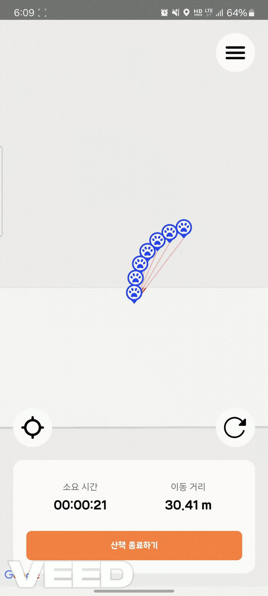

#  Mungple


## 📋 목차
- [Mungple](#mungple)
  - [📋 목차](#-목차)
  - [💡 프로젝트 소개](#-프로젝트-소개)
  - [🌟 프로젝트 주요 기능](#-프로젝트-주요-기능)
  - [🚀 프로젝트의 차별점 및 독창성](#-프로젝트의-차별점-및-독창성)
  - [📱 서비스 화면](#-서비스-화면)
    - [PWA Mobile App](#pwa-mobile-app)
  - [🛠 주요 기술 스택](#-주요-기술-스택)
      - [**Frontend**](#frontend)
  - [📦 프로젝트 구조](#-프로젝트-구조)
  - [🌐 외부 API](#-외부-api)
  - [👥 역할 별 담당자](#-역할-별-담당자)

## 💡 프로젝트 소개

**📆 진행 기간**
2024.08.19 ~ 2024.10.11 (7주)

**배경**
반려견을 키우는 인구가 1천만이 되며, 반려견들의 산책도 자주 볼 수 있습니다.
하지만, 안전한 산책로 정보의 부족과 예기치 않은 위험 요소로 인해 견주와 반려견들의
안정적인 산책을 방해받을 수 있습니다.
따라서, 반려견 주인들 사이의 교류와 소통이 중요해짐에 따라 서로의 산책 경험을
공유하고 함께 즐길 수 있는 어플을 만들게 되었습니다.

<br />

## 🌟 프로젝트 주요 기능
1. **실시간 마커 생성 및 블루, 레드존 생성**
  - 사용자가 마커를 생성하여 지도 상에 실시간으로 정보를 표시
    - 마커 색상은 블루, 레드이며 블루는 강아지 자랑이나 일반적인 정보등을 표시하며, 레드는 위험 요소 관련 정보를 나타냄
  - 블루, 레드존 토글 키로 블루 마커가 많이 찍힌 지역 및 레드 마커가 많이 찍힌 지역을 히트맵으로 확인할 수 있음 

2. **사용자 산책 경로 기록 및 표시**
  - 사용자가 산책을 시작 시 폴리 라인을 통해 사용자가 이동한 경로를 실시간으로 표시
  - 사용자가 산책 종료 시 걸린 시간, 산책한 날짜, 이동 거리와 함께 사용자의 이동 경로가 폴리 라인으로 표시되어 기록됨 

   <br />

## 🚀 프로젝트의 차별점 및 독창성
1. **로깅을 이용한 이벤트 및 사용자 활동 추적**
  - 각 로그 레벨별, 레이어별, 사용자별, 액션별로 데이터를 시각화하여 분석할 수 있음. 이를 통해 시스템이 어떤 상황에서 주로 로그가 발생하는지, 사용자들이 언제, 어떻게 시스템을 사용하고 있는지를 분석할 수 있음.
  - 트랜잭션ID와 같은 식별자를 로그에 기록함으로써, 여러 서비스가 관여된 복잡한 트랜잭션을 쉽게 추적할 수 있음. 트랜잭션 단위로 어떤 서비스에서 어떤 처리가 이루어졌는지 로그를 통해 추적할 수 있어 문제가 발생한 시점과 위치를 빠르게 파악할 수 있음.

2. **카프카와 히트맵을 이용한 실시간 히트맵 변경**
  - 사용자가 마커 생성 시, 백엔드로 보낸 좌표 데이터를 통해 마커 생성 좌표에 가중치를 추가하고, 추가한 가중치를 히트맵에 반영하여 실시간으로 히트맵이 갱신되도록 설계함. 이를 통해 사용자는 실시간으로 이용자들이 많은 지역 및 위험 지역을 직관적으로 파악할 수 있음.

<br />

## 📱 서비스 화면

### PWA Mobile App
<table>
   <tr>
      <th>시작 페이지</th>
      <th>홈 화면</th>
      <th>내정보</th>
      <th>리포트 리스트</th>
   </tr>
   <tr>
      <td></td>
      <td></td>
      <td></td>
      <td></td>
   </tr>
   <tr>
      <th>산책 시작</th>
      <th>산책 중</th>
      <th>산책 종료</th>
      <th>리포트 상세</th>
   </tr>
   <tr>
      <td></td>
      <td></td>
      <td></td>
      <td></td>
   </tr>
   <tr>
      <th>지도 첫 화면</th>
      <th>마커 정보</th>
      <th>반려견 등록</th>
      <th>반려견 상세</th>
   </tr>
   <tr>
      <td></td>
      <td></td>
      <td></td>
      <td></td>
   </tr>
</table>
<br /><br /><br />

## 🛠 주요 기술 스택

|                                                일정관리                                                 |                                               형상관리                                                |                                                커뮤니케이션                                                |                                                  디자인                                                   |
| :-----------------------------------------------------------------------------------------------------: | :---------------------------------------------------------------------------------------------------: | :--------------------------------------------------------------------------------------------------------: | :-------------------------------------------------------------------------------------------------------: |
|  |  |  |  |

<br />

#### **Frontend**


<br />

## 📦 프로젝트 구조

<details>
<summary><b>Mungple-Front</b></summary>

```
📦src
 ┣ 📂api : 서버와의 통신을 위한 API 호출 관련 로직을 관리하는 디렉토리
 ┣ 📂assets : 정적 자원을 저장하는 디렉토리
 ┣ 📂components : 재사용 가능한 UI 컴포넌트를 관리하는 디렉토리
 ┃ ┣ 📂common
 ┃ ┣ 📂map
 ┃ ┣ 📂marker
 ┃ ┣ 📂record
 ┃ ┣ 📂setting
 ┃ ┣ 📂user
 ┃ ┗ 📂walking
 ┣ 📂constants : 프로젝트에서 사용되는 상수 값을 정의하는 디렉토리
 ┣ 📂hooks : 커스텀 훅을 저장하는 디렉토리
 ┃ ┣ 📂queries : 데이터 fetching과 관련된 쿼리 훅을 관리
 ┣ 📂navigations : 화면 간의 네비게이션 로직을 관리하는 디렉토리
 ┃ ┣ 📂root
 ┃ ┣ 📂stack
 ┃ ┗ 📂tab
 ┣ 📂screens : 각각의 화면(UI)을 정의하는 디렉토리
 ┃ ┣ 📂auth
 ┃ ┣ 📂home
 ┃ ┣ 📂map
 ┃ ┣ 📂record
 ┃ ┣ 📂user
 ┃ ┗ 📂walking
 ┣ 📂state : 전역 상태 관리 로직을 정의하는 디렉토리
 ┣ 📂types : 타입 정의 파일을 저장하는 디렉토리
 ┗ 📂utils : 유틸리티 함수들을 관리하는 디렉토리
```
</details>

## 🌐 외부 API
- **GOOGLEMAP API**: 지도 서비스와 관련된 다양한 기능을 활용하기 위해 GOOGLEMAP API를 사용합니다.

## 👥 역할 별 담당자

<table style="table-layout: fixed; width: 100%;">
  <tr>
    <td style="text-align: center;">
      
    </td>
    <td style="text-align: center;">
      
    </td>
    <td style="text-align: center;">
      
    </td>
  </tr>
  <tr>
    <td style="text-align: center; word-wrap: break-word;">윤대영</td>
    <td style="text-align: center; word-wrap: break-word;">임경태</td>
    <td style="text-align: center; word-wrap: break-word;">박지원</td>
  </tr>
  <tr>
    <td style="text-align: center; word-wrap: break-word;">Frontend</td>
    <td style="text-align: center; word-wrap: break-word;">Frontend</td>
    <td style="text-align: center; word-wrap: break-word;">Frontend</td>
  </tr>
  <tr>
    <td style="text-align: center; word-wrap: break-word;"></td>
    <td style="text-align: center; word-wrap: break-word;">▪ 화면 구조 설계 및 네비게이터 구현<br>▪ OAuth 및 회원 관련 기능<br>▪ 산책 기능 및 위치 전송 웹 소켓<br>▪ React-query 사용 및 화면 렌더 성능 향상<br>▪ 앱 테마 디자인 및 퍼블리싱<br></td>
    <td style="text-align: center; word-wrap: break-word;"></td>
  </tr>
</table>
